#  Jewel Puzzle AI: 基於 PPO 的強化學習消除遊戲解題系統


本專案旨在利用 **深度強化學習 (Deep Reinforcement Learning)** 技術，訓練一個能夠精通「橫向卷軸消除遊戲」的 AI 代理 (Agent)。我們採用了 **自適應 PPO (Adaptive Proximal Policy Optimization)** 演算法，並結合了多核心並行訓練 (Multiprocessing) 與啟發式引導 (Heuristic Guidance)，讓 AI 能夠在複雜的隨機環境中學會「分組」、「連鎖」與「危機處理」。

---

##  目錄

1.  [遊戲規則與環境](#1-遊戲規則與環境)
2.  [PPO 演算法介紹](#2-ppo-演算法介紹)
3.  [系統架構與訓練設計](#3-系統架構與訓練設計)
    * [神經網路模型 (CNN + Attention)](#31-神經網路模型-match3actorcritic)
    * [多核心並行訓練](#32-多核心並行訓練-subprocvecenv)
    * [自適應 PPO 機制](#33-自適應-ppo-機制-adaptive-mechanism)
4.  [Breakdown](#4-Breakdown)
5.  [系統架構](#5-Jewel-Puzzle-AI-系統架構)
6.  [API](#6-API-規格說明)
    * [神經網路模型](#61-神經網路模型-(Neural-Network))
    
8.  [訓練成果展示](#4-訓練成果展示)
9.  [如何執行](#5-如何執行)

---

## 1. 遊戲規則與環境

本專案模擬了一個經典的「橫向卷軸三消遊戲」(類似 Panel de Pon / Tetris Attack)。

###  遊戲機制
* **棋盤大小**：9 行 (Rows) x 6 列 (Cols)。
* **寶石種類**：7 種普通顏色 + 1 種牆壁 (Wall)。
* **初始棋盤**：一開始會有三排不可
* 消去之隨機寶石，死亡後會自動回到初始狀態

  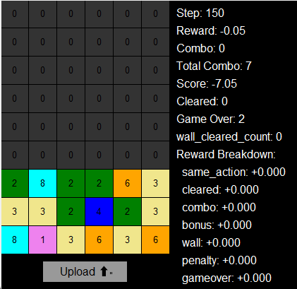
  
* **動作空間 (Action Space)**：
    * **Swap**：點擊任意寶石，將其與**右邊**的寶石交換位置。
      
      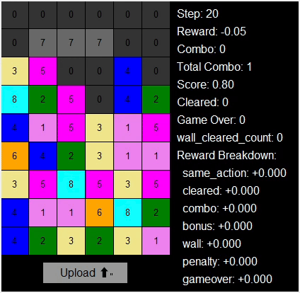
      
    * **Upload**：強制讓底部上升一層 (當頂層有空位時)。
      
      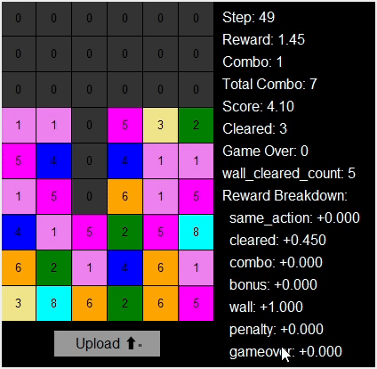
      
    * **重力系統**：整個環境都會有重力系統，當寶石下面為空時，寶石會因重力下落，牆壁也會下落。
      
      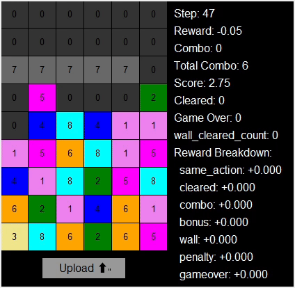
      
* **消除規則**：
    * **3消 (Match-3)**：橫向或縱向 3 個以上同色寶石連線，即可消除。
      
      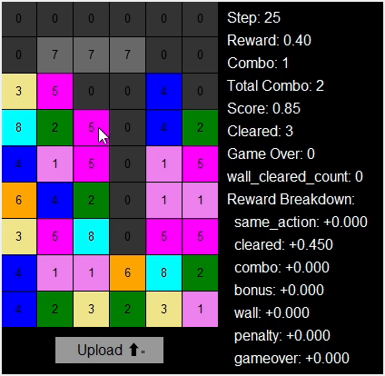
      
    * **連鎖 (Chain/Combo)**：消除後上方的寶石會受到重力掉落，若再次形成消除，則觸發 Combo，分數加倍。
    * **牆壁 (Wall)**：牆壁每隔一定步數會隨機生成一橫排之隨機數量牆壁並視為一個整體且無法直接交換，必須消除其周圍的寶石才能將牆壁轉化為隨機普通寶石。
      
      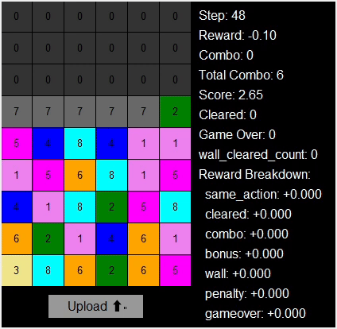
      
* **失敗條件 (Game Over)**：當寶石或牆壁觸碰到最頂層 (第 0 層) 並停留超過一定步數 (Game Over Timer)，遊戲結束。
  
  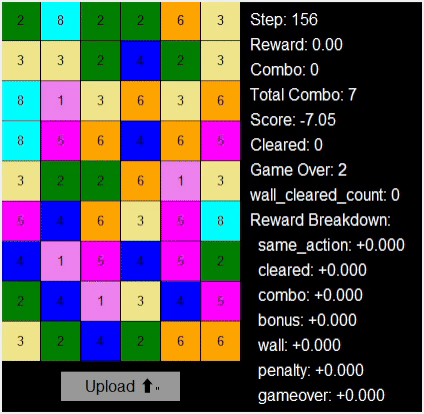

###  環境挑戰
這是一個**部分可觀測 (Partially Observable)** 且 **隨機性極高** 的環境：
1.  **隨機牆壁**：底部會隨機生成無法移動的牆壁，擠壓生存空間。
2.  **連鎖預測**：AI 必須學會「預判」掉落後的盤面，而不僅僅是看眼前的消除。
3.  **危機處理**：在牆壁逼近頂層時，AI 必須從「貪分模式」切換到「生存模式」。

---

## 2. PPO 演算法介紹

我們選擇 **PPO (Proximal Policy Optimization)** 作為核心演算法，這是目前 OpenAI 最推薦的強化學習算法之一。

### 為什麼選擇 PPO？
相較於 DQN (Deep Q-Network) 或 A2C，PPO 有以下優勢：
* **穩定性 (Stability)**：PPO 限制了每次更新的幅度 (Clip)，防止模型因為一次壞的更新而崩潰。
* **樣本效率 (Sample Efficiency)**：支援多個 Epoch 重複使用同一批收集到的數據進行更新。
* **連續動作與離散動作皆適用**：非常適合這種策略梯度 (Policy Gradient) 的場景。

### PPO 核心公式
PPO 的目標函數如下：

$$L^{CLIP}(\theta) = \hat{\mathbb{E}}_t \left[ \min(r_t(\theta)\hat{A}_t, \text{clip}(r_t(\theta), 1-\epsilon, 1+\epsilon)\hat{A}_t) \right]$$

其中：
* $r_t(\theta)$ 是新舊策略的機率比值 (Ratio)。
* $\hat{A}_t$ 是優勢函數 (Advantage)，代表該動作比平均好多少。
* $\text{clip}$ 函數確保更新幅度不會超過 $\epsilon$ (通常設為 0.2)。

---

## 3. 系統架構與訓練設計

為了讓 AI 能夠學會如此複雜的遊戲，我們設計了一套完整的訓練系統。

### 3.1 神經網路模型 (Match3ActorCritic)

我們使用了一個共享卷積骨幹 (CNN Backbone) 的 Actor-Critic 架構，並設計了專門的 One-Hot 輸入層來處理遊戲盤面。

####  輸入層設計 (One-Hot Encoding Table)
原始盤面是 9x6 的整數矩陣（每個格子儲存寶石 ID），我們將其轉換為 **10 層通道 (Channels)** 的 One-Hot 格式。這意味著棋盤狀態被拆解為 **0 與 1 的二進位矩陣**，每一層都代表一種特定的寶石類型或特殊狀態。這樣做能讓 CNN 清楚區分不同的物件屬性，而非將 ID 視為連續數值。

| 通道索引 (Channel) | 代表物件 | 說明 |
| :---: | :--- | :--- |
| **0** | Empty (空) | 若該格為空氣，此層對應位置為 1，否則為 0 |
| **1** | Red Gem | 若該格為紅色寶石，此層對應位置為 1 |
| **2** | Blue Gem | 若該格為藍色寶石，此層對應位置為 1 |
| **3** | Green Gem | 若該格為綠色寶石，此層對應位置為 1 |
| **4** | Yellow Gem | 若該格為黃色寶石，此層對應位置為 1 |
| **5** | Purple Gem | 若該格為紫色寶石，此層對應位置為 1 |
| **6** | Orange Gem | 若該格為橘色寶石，此層對應位置為 1 |
| **7** | Cyan Gem | 若該格為青色寶石，此層對應位置為 1 |
| **8** | Wall (牆壁) | 若該格為牆壁，此層對應位置為 1 |
| **9** | **Action Mask** | **無效動作遮罩** (剛交換過的位置標記為 1，其餘為 0) |

> **設計理念**：將牆壁 (Wall) 與 Mask 獨立成單獨的通道，能讓卷積層更輕易地學會「牆壁不能動」以及「不要重複操作同一格」的規則。

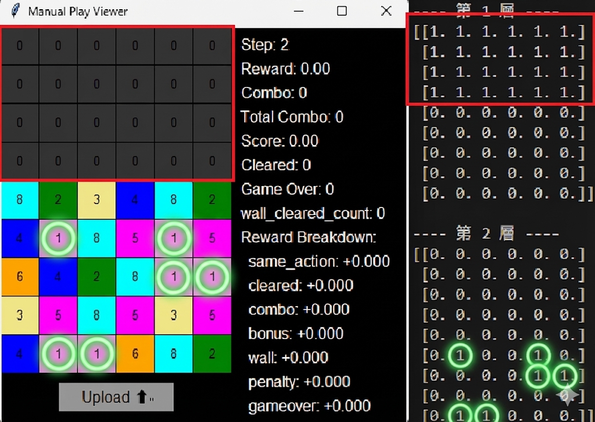
> **圖片說明** :紅色方框依照定義是Empty (空) 所對應位置的值就是1；綠色圓圈依照定義為Red Gem(紅色寶石)其 所對應位置的值就是1
####  CNN 網路架構 (Network Architecture)
模型採用 3 層卷積層提取局部特徵，並引入 **Self-Attention** 機制來捕捉全域的連鎖關係。

| 層級 (Layer) | 輸入形狀 (Input Shape) | 操作 (Operation) | 輸出形狀 (Output Shape) | 說明 |
| :--- | :--- | :--- | :--- | :--- |
| **Input** | `(10, 9, 6)` | - | - | 10 層 One-Hot 盤面 |
| **Conv1** | `(10, 9, 6)` | Conv2d(3x3, 32) + ReLU | `(32, 9, 6)` | 提取基礎紋理特徵 |
| **Conv2** | `(32, 9, 6)` | Conv2d(3x3, 64) + ReLU | `(64, 9, 6)` | 提取高階特徵 (如形狀) |
| **Conv3** | `(64, 9, 6)` | Conv2d(3x3, 64) + ReLU | `(64, 9, 6)` | 加深特徵表達 |
| **Attention**| `(64, 9, 6)` | **Self-Attention** | `(64, 9, 6)` | **捕捉全域連鎖與空間關係** |
| **Flatten** | `(64, 9, 6)` | Flatten | `(3456)` | 展平為向量 |
| **FC (Actor)** | `(3456)` | Linear(512) + ReLU | `(Action Dim)` | 輸出動作機率分佈 |
| **FC (Critic)**| `(3456)` | Linear(512) + ReLU | `(1)` | 輸出盤面價值 (Value) |

> **Self-Attention 的作用**：在消除遊戲中，底部的消除往往會引發頂部的掉落。傳統 CNN 的感受野 (Receptive Field) 有限，難以關聯相距較遠的方塊。Attention 機制允許模型「關注」盤面上任意兩個位置的關聯，從而學會預判連鎖。

### 3.2 多核心並行訓練 (SubprocVecEnv)
單一環境的採樣速度太慢，我們使用 `multiprocessing` 開啟 **18 個並行環境**：
* 每個 CPU 核心負責一個獨立的遊戲環境。
* 主進程收集 18 個環境的 `(State, Reward, Done)`，打包成 Batch 送入 GPU 訓練。
* 這讓訓練速度提升了約 **15 倍**。

### 3.3 自適應 PPO 機制 (Adaptive Mechanism)
為了確保模型在長時間訓練下的穩定性，我們實作了 **自適應學習率 (ReduceLROnPlateau)**。系統會持續監控「平均分數」，當 AI 進步停滯時自動降低學習率，進行更精細的優化。

---
## 4. Breakdown
 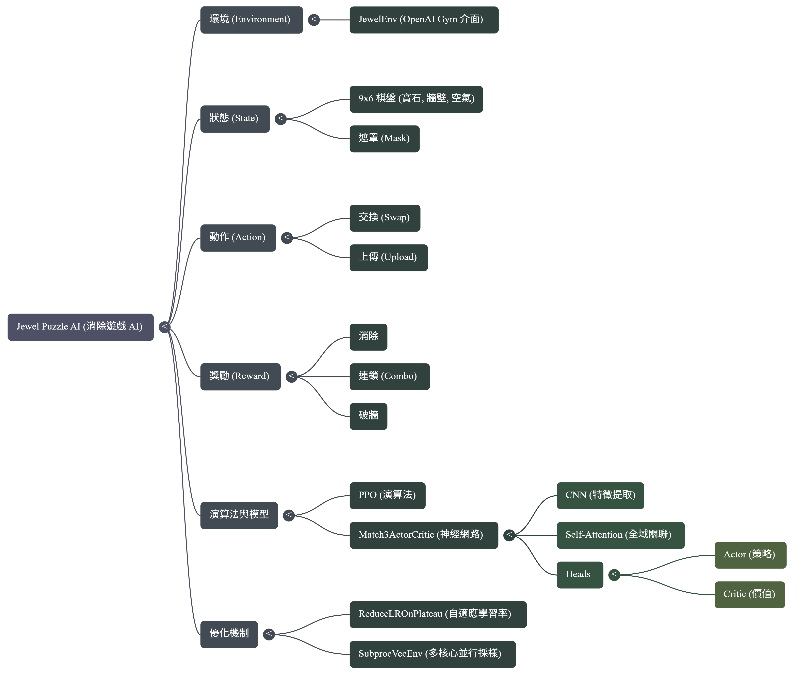
---
## 5. Jewel Puzzle AI 系統架構

這是我專案的系統架構圖：

```mermaid
graph TD
    %% 定義樣式
    classDef root fill:#2c3e50,stroke:#fff,stroke-width:2px,color:#fff;
    classDef env fill:#e67e22,stroke:#d35400,stroke-width:2px,color:#fff;
    classDef algo fill:#2980b9,stroke:#3498db,stroke-width:2px,color:#fff;
    classDef expert fill:#27ae60,stroke:#2ecc71,stroke-width:2px,color:#fff;
    classDef train fill:#8e44ad,stroke:#9b59b6,stroke-width:2px,color:#fff;
    classDef ui fill:#f1c40f,stroke:#f39c12,stroke-width:2px,color:#fff;
    classDef sub fill:#ecf0f1,stroke:#bdc3c7,stroke-width:1px,color:#333;

    %% 根節點
    Root[Jewel Puzzle AI Project]:::root

    %% 第一層
    Env[環境 Environment<br>GAME_jewel_env_blacklist.py]:::env
    Algo[演算法 Algorithm<br>PPO_Agent_Multitasking.py]:::algo
    Train[訓練架構 Training<br>train_ppo_multicore.py]:::train
    UI[應用介面 Application<br>gui_simulator.py]:::ui

    Root --> Env
    Root --> Algo
    Root --> Train
    Root --> UI

    %% 環境細節
    Env --> State[狀態定義 State]:::sub
    State --> OneHot[10層 One-Hot 編碼<br>寶石/牆壁/遮罩]:::sub
    Env --> Logic[遊戲邏輯 Logic]:::sub
    Logic --> Rules[消除/連鎖/重力]:::sub
    Logic --> Wall[隨機牆壁生成]:::sub
    Env --> Reward[獎勵機制 Reward]:::sub
    Reward --> R_Calc[消除分/破牆分/懲罰]:::sub

    %% 演算法細節
    Algo --> Network[神經網路 Match3ActorCritic]:::sub
    Network --> CNN[CNN 卷積層<br>特徵提取]:::sub
    Network --> Attention[Self-Attention<br>全域關聯]:::sub
    Network --> Heads[輸出層 Heads]:::sub
    Heads --> Actor[Actor 策略網路]:::sub
    Heads --> Critic[Critic 價值網路]:::sub
    Algo --> Opt[優化機制]:::sub
    Opt --> PPO[PPO Clip Update]:::sub
    Opt --> LR[自適應學習率<br>ReduceLROnPlateau]:::sub


    %% 訓練架構細節
    Train --> Multi[多核心處理]:::sub
    Multi --> MP[Multiprocessing<br>18 Workers]:::sub

    %% UI 細節
    UI --> Visual[視覺化]:::sub
    Visual --> Tkinter[Tkinter GUI]:::sub
    UI --> Control[控制模式]:::sub
    Control --> Auto[AI 自動掛機]:::sub
    Control --> Debug[死亡快照/提示]:::sub
```


---


## 6. API 規格說明 (API Specification)

本專案核心模組的詳細 API 介面說明。

### 1. 神經網路模型 (Neural Network)
**檔案名稱：** `ActorCritic_Multitasking.py`
負責處理視覺特徵提取與決策生成的深度學習模型。

| 項目 | 說明 |
| :--- | :--- |
| **類別名稱** | `Match3ActorCritic(nn.Module)` |
| **輸入 (Input)** | **狀態張量 (State Tensor)** <br> - 形狀：`(Batch_Size, 10, 9, 6)` <br> - 內容：前 9 層為寶石 One-Hot 編碼，第 10 層為 Action Mask。 |
| **輸出 (Output)** | **1. 動作分佈 (Action Logits)** <br> - 形狀：`(Batch_Size, 54)` <br> - 說明：對應 54 種離散動作的未歸一化機率。<br><br>**2. 狀態價值 (State Value)** <br> - 形狀：`(Batch_Size, 1)` <br> - 說明：預測當前盤面的獲勝機率或預期得分。 |
| **核心參數** | - `input_shape`: `(10, 9, 6)` <br> - `num_actions`: `54` (53種交換 + 1種upload) |
| **主要方法** | - `forward()`: (未實作，主要使用 act/evaluate) <br> - `act(state, mask)`: 推論模式，回傳動作與 Log Prob。 <br> - `evaluate(state, action)`: 訓練模式，回傳 Log Prob, Value 與 Entropy。 |
| **架構特點** | - **CNN Backbone**: 3 層卷積層提取局部紋理。 <br> - **Self-Attention**: 計算全域關聯矩陣 (N, N)，捕捉遠距離連鎖特徵。 |

### 2. PPO 代理 (Reinforcement Learning Agent)
**檔案名稱：** `PPO_Agent_Multitasking.py`
負責與環境互動、收集數據並執行 PPO 演算法更新的代理人。

| 項目 | 說明 |
| :--- | :--- |
| **類別名稱** | `PPOAgent` |
| **輸入 (Input)** | **環境觀測值 (Observation)** <br> - 格式：Numpy Array `(10, 9, 6)` 或 Tensor |
| **輸出 (Output)** | **決策動作 (Action)** <br> - 格式：整數 `int` (範圍 0~53) <br> - 說明：直接對應環境的具體操作。 |
| **核心參數** | - `lr`: 學習率 (搭配 Scheduler 使用) <br> - `gamma`: 折扣因子 (預設 0.99) <br> - `eps_clip`: PPO 截斷範圍 (預設 0.2) <br> - `k_epochs`: 每次更新的循環次數 (預設 4) |
| **主要方法** | - `select_action(state)`: 將狀態轉為 Tensor 並從策略網路採樣動作。 <br> - `update()`: 取出 Buffer 中的軌跡數據，計算 Advantage 並執行梯度下降更新。 |

### 3. 遊戲環境 (Environment)
**檔案名稱：** `GAME_jewel_env_blacklist.py`
遵循 OpenAI Gym 介面的遊戲模擬器，負責邏輯運算與物理模擬。

| 項目 | 說明 |
| :--- | :--- |
| **類別名稱** | `JewelEnv(gym.Env)` |
| **輸入 (Input)** | **動作指令 (Action ID)** <br> - 格式：整數 `int` <br> - 說明：0~52 為交換動作，53 為 Upload (上推)。 |
| **輸出 (Output)** | **1. 下一狀態 (Next Obs)**: `(10, 9, 6)` One-Hot 矩陣 <br> **2. 獎勵 (Reward)**: 浮點數 (基於消除數、連鎖、破牆給分) <br> **3. 結束訊號 (Done)**: 布林值 (是否 Game Over) <br> **4. 資訊 (Info)**: 字典 (包含 Combo 數、消除細節) |
| **核心參數** | - `reward_mode`: `"advanced"` (推薦使用進階獎勵) <br> - `wall_timer`: 隨機牆壁生成的倒數計時器 |
| **主要方法** | - `step(action)`: 執行一步模擬，包含交換、消除、掉落、生成牆壁。 <br> - `reset()`: 重置棋盤，隨機生成初始局面。 <br> - `render()`: (選用) 視覺化當前盤面。 |

### 5. 多核心環境管理器 (Multiprocessing Environment)
**檔案名稱：** `train_ppo_multicore.py`

負責管理多個獨立運行的遊戲環境進程，利用 `multiprocessing` 實現並行數據收集，是加速訓練的關鍵組件。

| 項目 | 說明 |
| :--- | :--- |
| **類別名稱** | `SubprocVecEnv` |
| **輸入 (Init)** | `num_envs`: 整數 (int) <br> - 說明：指定同時開啟的環境數量 (例如 18)。 |
| **輸出 (Output)** | 環境管理器實例 (Instance) |
| **主要方法** | - **`step(actions)`**: 同步對所有子環境執行動作。 <br> &nbsp;&nbsp; **輸入**: `actions` (List[int])，長度需等於 `num_envs`。 <br> &nbsp;&nbsp; **輸出**: `obs`, `rewards`, `dones`, `infos`, `solver_acts` (皆為堆疊後的 Numpy Array)。 <br><br> - **`reset()`**: 重置所有子環境。 <br> &nbsp;&nbsp; **輸出**: `obs` (初始狀態), `solver_acts` (專家建議)。 |
| **運作機制** | 透過 `mp.Pipe` 建立父子進程通訊管道。主進程發送 `('step', action)` 指令，Worker 進程執行後回傳結果字典。 |

### 6. 測試與驗證模組 (Testing Interface)
**檔案名稱：** `test_model.py`

用於載入訓練完成的模型權重 (`.pth`)，進行視覺化推論與效能評估。

| 項目 | 說明 |
| :--- | :--- |
| **函式名稱** | `test()` |
| **輸入 (Config)** | - `MODEL_PATH`: 預訓練模型的檔案路徑。 <br> - `INPUT_SHAPE`: `(10, 9, 6)`，需與訓練時一致。 <br> - `RENDER_DELAY`: 動作顯示的延遲時間 (秒)，便於肉眼觀察。 |
| **輸出 (Console)** | - **即時資訊**: 每一步的動作類型 (Swap/Upload)、獎勵、消除數。 <br> - **統計摘要**: 測試結束後的平均分數與平均消除寶石數。 |
| **功能流程** | 1. **環境初始化**: 建立 `JewelEnv` (通常使用 `simple` 獎勵模式)。 <br> 2. **模型載入**: 實例化 `PPOAgent` 並讀取 `state_dict`。 <br> 3. **推論迴圈**: 執行 `agent.select_action` -> `env.step` -> `env.render`。 <br> 4. **評估**: 計算 `Total Reward` 與 `Total Cleared`。 |


---


## 7. 訓練成果展示

經過 1000 萬步 (約 24 小時) 的訓練，AI 展現出了驚人的策略演化：

###  訓練曲線
   * **loss曲線**
     
      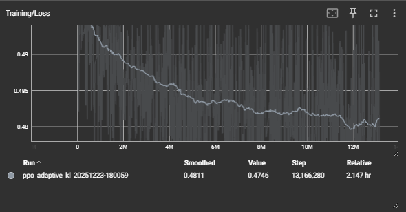
     
      > **圖片說明** :依照圖片可以發現loss逐漸往下收斂

   * **KL曲線**
     
      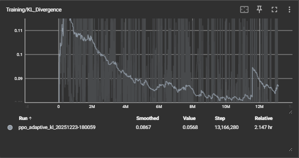

     > **圖片說明** :依照圖片可以發現KL逐漸往下收斂

   * **每步平均分數**

      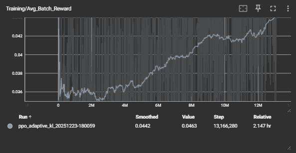

     > **圖片說明** :依照圖片可以發現每步平均分數逐漸上升
     

---


###  實際遊玩演示 (GIF)

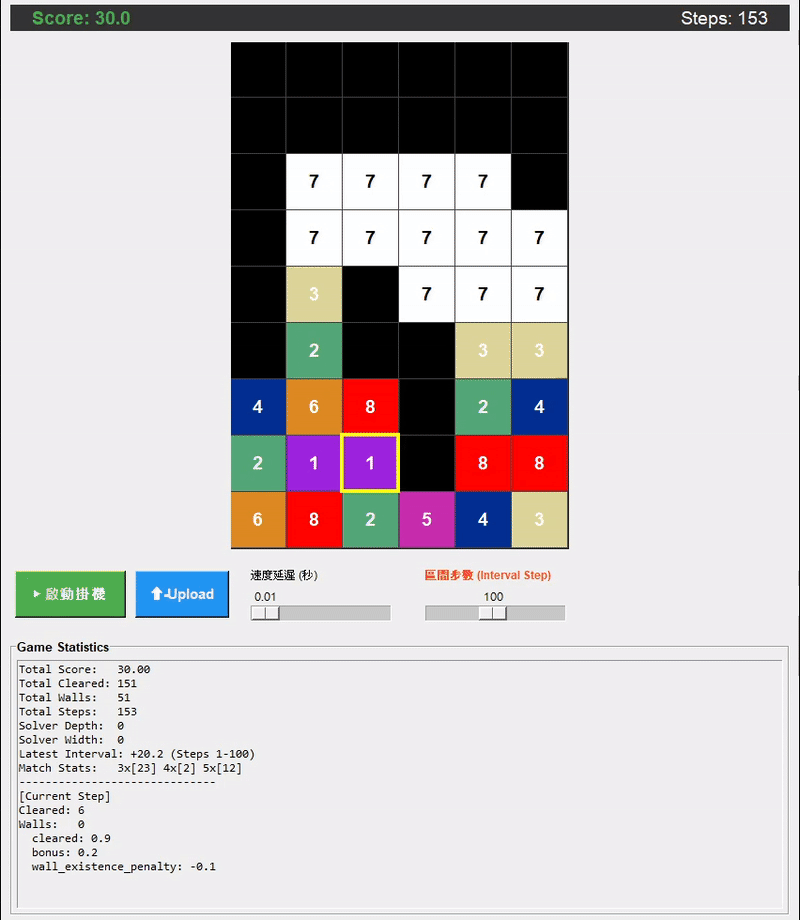

**觀察到的高階技巧**：
1.  **精準破牆**：當牆壁出現時，AI 會優先尋找牆壁旁的消除機會。
   
   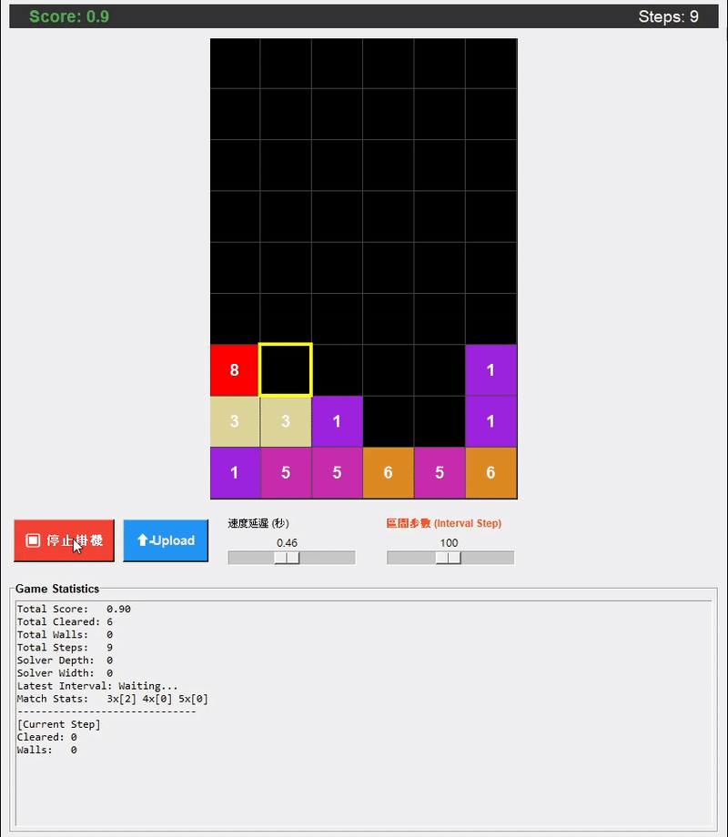
   
3.  **三消**：三個相同寶石消去。

   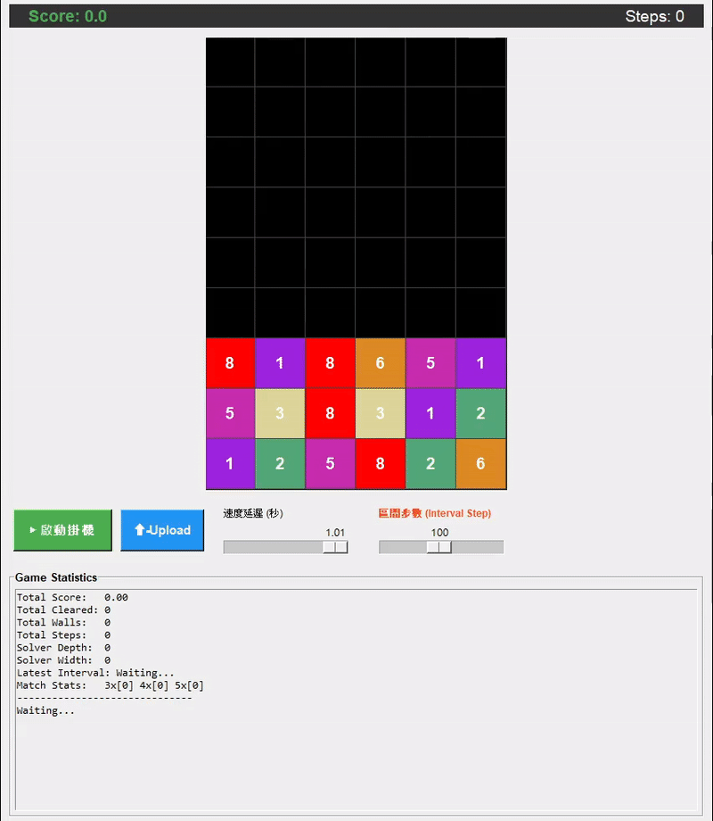

4.  **四消**：四個相同寶石消去。

   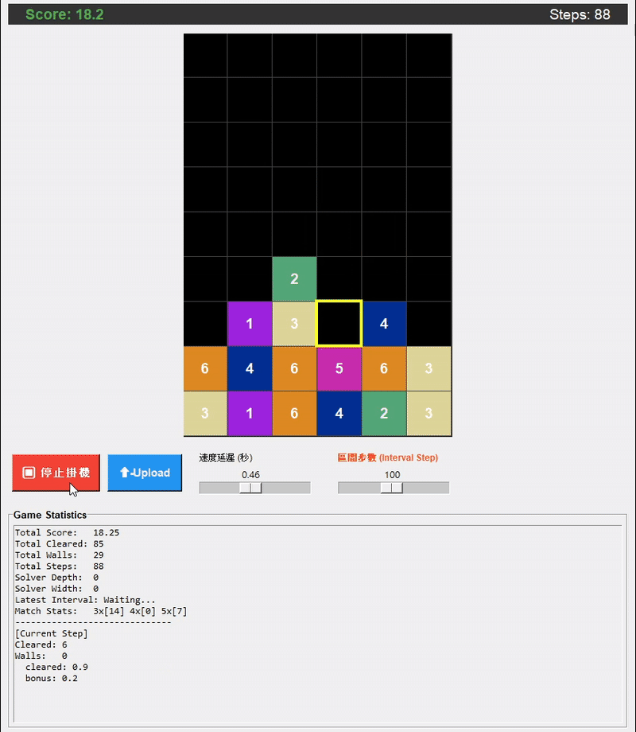

5.  **五消以上**：五個相同寶石消去。

   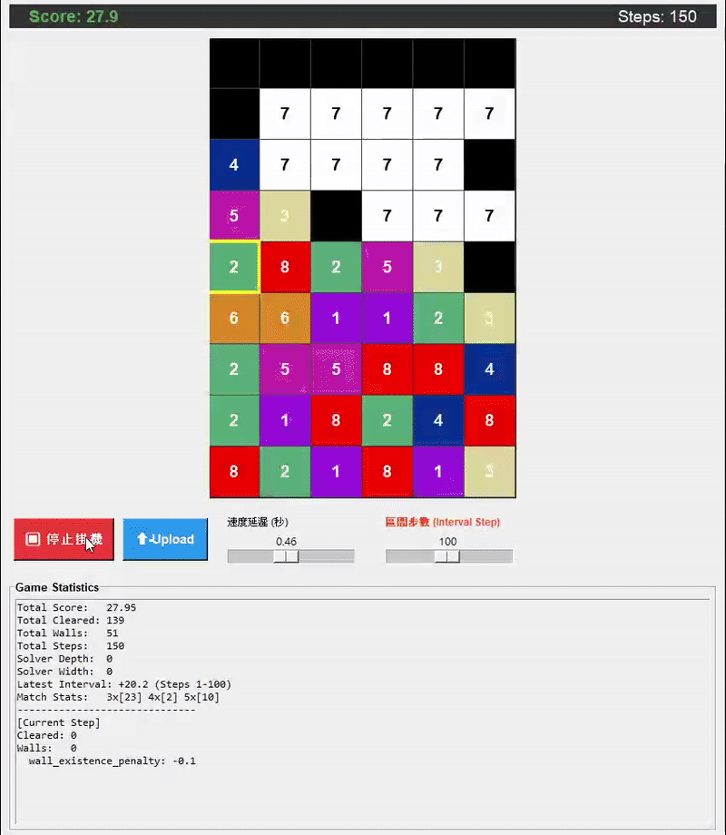

   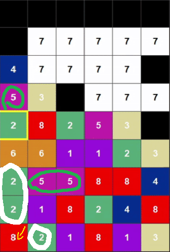

   > **圖片說明**：點擊最左下角之紅色寶石(寶石編號8)，會與右邊的綠色寶石(寶石編號2)互換，將白色所圈選的寶石消去，因上面寶石會因重力而下降，並且將綠色圈選之桃紅色寶石(寶石編號5)消去

---

## 8. 如何執行

### 環境需求
* Python 3.8+
* PyTorch 2.0+
* Gymnasium
* NumPy, Pillow, Matplotlib

### 1. 安裝依賴
```bash
pip install torch gymnasium numpy pillow tensorboard tqdm
